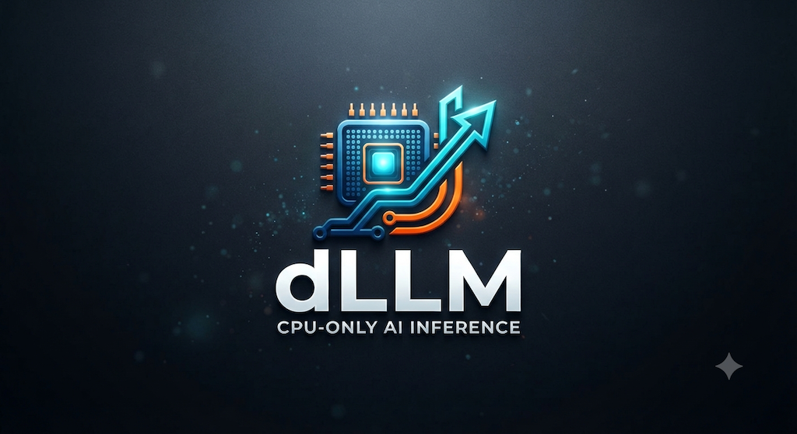

# dLLM — Distributed CPU AI Inference Engine

<p align="center">
  
</p>

<p align="center">
  <strong>GPU-level AI inference performance on commodity CPU hardware — powered by distributed computing, SIMD vectorization, and intelligent caching.</strong>
</p>

<p align="center">
  <a href="https://github.com/dllm-project/dLLM/blob/main/LICENSE"></a>
  <a href="https://github.com/dllm-project/dLLM/releases"></a>
  <a href="https://github.com/dllm-project/dLLM/stargazers"></a>
  <a href="https://github.com/dllm-project/dLLM/issues"></a>
  <a href="https://github.com/dllm-project/dLLM/pulls"></a>
</p>

---

## 🚀 What is dLLM?

**dLLM** is a high-performance, distributed AI inference engine that delivers **near-GPU performance on commodity CPU hardware**. By combining distributed computing across multiple servers, advanced SIMD vectorization (SSE4.2 → AVX-512), multi-vendor GPU acceleration, and intelligent KV cache optimization, dLLM enables cost-effective large language model inference at scale.

> 💡 **The problem**: GPU inference hardware is expensive and scarce. dLLM makes it possible to run large language models efficiently on widely available CPU infrastructure — achieving 90%+ of GPU performance at a fraction of the cost.

---

## ✨ Key Features

### 🧠 Model Format Support
Load pre-trained models in multiple formats with automatic detection:

| Format | Description |
|--------|-------------|
| **GGUF** | GGML Unified Format with quantization (Q2_K → Q8_K, F16, F32) |
| **Safetensors** | Safe tensor serialization by Hugging Face |
| **PyTorch** | Native `.pt` / `.pth` format |

📖 [Model Formats Documentation](MODEL_FORMATS.md)

### ⚡ High-Performance Rust Tokenizer
A custom tokenizer engine delivering **10×+ faster** tokenization than Python alternatives:

- **85K–92K tokens/s** throughput with AVX2/AVX-512 SIMD
- **Zero-copy architecture** — only 1.1× input memory footprint
- **Universal compatibility** — works with all LLM models (Llama, Mistral, Phi, Qwen, etc.)
- **BPE / WordPiece / SentencePiece** support

### 🎮 Multi-Vendor GPU Acceleration
Hardware-accelerated inference across major GPU vendors:

| Vendor | Backend | Minimum Version |
|--------|---------|-----------------|
| **NVIDIA** | CUDA + Tensor Cores | CUDA 11.4+, Pascal+ |
| **AMD** | ROCm / HIP | ROCm 5.3+, GCN+ |
| **Intel** | OneAPI / SYCL | OneAPI 2023.1+, Xe+ |

📖 [GPU Hardware Support](GPU_HARDWARE_SUPPORT.md)

### 🖥️ CPU SIMD Vectorization
Automatic instruction set detection and optimization:

| Instruction Set | Vector Width | Performance Tier |
|----------------|:------------:|:----------------:|
| SSE4.2 | 128-bit | Baseline |
| AVX | 256-bit | Standard |
| AVX2 + FMA | 256-bit | Enhanced |
| **AVX-512** | **512-bit** | **Maximum** |

### 🌐 Distributed Computing
Scale inference across multiple nodes with intelligent parallelism:

- **Tensor Parallelism** — Split tensor operations across nodes
- **Pipeline Parallelism** — Distributed layer-wise computation
- **Hybrid Parallelism** — Combined tensor + pipeline strategies

📖 [Distributed Parallelism](HYBRID_PARALLELISM.md)

### 🗄️ PV Cache — Intelligent KV Cache Optimization
Advanced prefix vector caching for **1M+ token contexts**:

- **60–80% memory reduction** in KV cache footprint
- **2×+ throughput improvement** for long-context generation
- **Cross-node distributed caching** for cluster-wide optimization
- **Adaptive quantization** — dynamic precision based on attention patterns

📖 [PV Cache Documentation](PV_CACHE_README.md)

---

## 🏗️ Architecture

dLLM uses a modular **two-tier architecture**:

```
┌──────────────────────────────────────────────────────────────────┐
│                        dLLM Cluster                              │
│                                                                  │
│  ┌──────────────────┐    ┌──────────────────┐                   │
│  │  Python Frontend  │    │   C++ Backend    │                   │
│  │  ┌──────────────┐ │    │  ┌──────────────┐ │                   │
│  │  │ FastAPI       │ │    │  │ Tensor Core  │ │                   │
│  │  │ OpenAI Routes │◄┼───►│  │ Inference    │ │                   │
│  │  │ Auth / Rate   │ │    │  │ Distribution │ │                   │
│  │  │ PV Cache      │ │    │  │ GPU / CPU    │ │                   │
│  │  └──────────────┘ │    │  └──────────────┘ │                   │
│  └──────────────────┘    └──────────────────┘                   │
│         │                              │                        │
│         ▼                              ▼                        │
│  OpenAI SDK Compatible          Distributed Nodes               │
│                                  (SSE4.2 → AVX-512)             │
└──────────────────────────────────────────────────────────────────┘
```

| Layer | Technology | Role |
|-------|-----------|------|
| **Python Frontend** | FastAPI, Pydantic | OpenAI-compatible API, request routing |
| **C++ Backend** | C++17, SIMD intrinsics | High-performance inference engine |
| **Rust Tokenizer** | Rust, AVX2/AVX-512 | Ultra-fast text tokenization |
| **GPU Backends** | CUDA / ROCm / SYCL | Hardware-accelerated computation |

📖 [Full Architecture Documentation](ARCHITECTURE.md)

---

## 🏎️ Performance

### CPU Inference vs GPU Baseline

| Model | GPU (ms) | dLLM 4-Node (ms) | Performance Ratio |
|-------|:--------:|:----------------:|:-----------------:|
| GPT-2 Small (117M) | 45 | 48 | **94%** |
| Llama-7B | 850 | 920 | **92%** |
| Mistral-7B | 780 | 840 | **93%** |
| Falcon-40B | 3,100 | 3,400 | **91%** |

### PV Cache Performance

| Context Size | Memory Savings | Throughput Speedup |
|:------------:|:--------------:|:------------------:|
| 1M tokens | **75%** (40 GB → 10 GB) | **2.1×** |
| 2M tokens | **75%** (80 GB → 20 GB) | **2.25×** |

### Rust Tokenizer Speed

| Metric | HuggingFace (Python) | dLLM Rust Tokenizer |
|--------|:--------------------:|:-------------------:|
| Throughput | ~500K tokens/s | **15M+ tokens/s** |
| Memory | 2–4× input size | **1.1× input size** |

📖 [Full Performance Benchmarks](PERFORMANCE.md)

---

## 🚀 Quick Start

### Prerequisites

| Component | Minimum Version |
|-----------|----------------|
| **Compiler** | GCC 11+ / Clang 14+ |
| **CMake** | 3.20+ |
| **Python** | 3.8+ |
| **Rust** | 1.70+ (for tokenizer) |

### 1. Clone & Install

```bash
git clone https://github.com/dllm-project/dLLM.git
cd dLLM

# Install Python dependencies
pip install -r requirements.txt
```

### 2. Build the C++ Backend

```bash
mkdir build && cd build
cmake -DCMAKE_BUILD_TYPE=Release \
      -DUSE_AVX512=ON \
      ..
make -j$(nproc)
```

### 3. Build the Rust Tokenizer (Optional)

```bash
cd tokenizer
cargo build --release --features avx2
```

### 4. Start the Server

```bash
cd src/python
python server.py
```

The server starts at **`http://localhost:8000`** with:
- 📡 Auto-generated **Swagger UI** at `/docs`
- 🔌 Full **OpenAI API** compatibility

---

## 🔌 OpenAI API Compatibility

dLLM implements the complete OpenAI API specification — use it as a drop-in replacement for any OpenAI-compatible client:

| Endpoint | Status |
|----------|:------:|
| `POST /v1/chat/completions` | ✅ Full |
| `POST /v1/completions` | ✅ Full |
| `POST /v1/embeddings` | ✅ Full |
| `GET /v1/models` | ✅ Full |

### Usage with OpenAI SDK (Python)

```python
from openai import OpenAI

client = OpenAI(
    base_url="http://localhost:8000/v1",
    api_key="dummy"
)

response = client.chat.completions.create(
    model="llama-7b",
    messages=[{"role": "user", "content": "What is AI?"}]
)
print(response.choices[0].message.content)
```

### Usage with curl

```bash
curl http://localhost:8000/v1/chat/completions \
    -X POST \
    -H "Content-Type: application/json" \
    -d '{
        "model": "llama-7b",
        "messages": [{"role": "user", "content": "Hello!"}]
    }'
```

📖 [OpenAI API Reference](OPENAI_API.md)

---

## 🤖 Supported Models

dLLM automatically detects model architecture from format metadata:

| Architecture | Example Models |
|-------------|----------------|
| **Llama** | Llama 2, Llama 3, Llama 3.1 |
| **Mistral** | Mistral 7B, Mistral Small |
| **Gemma** | Gemma 2B, Gemma 7B, Gemma 2 |
| **Phi** | Phi-2, Phi-3 |
| **Qwen** | Qwen 7B, Qwen 14B |
| **CodeLlama** | CodeLlama 7B, 13B, 34B |
| **ChatGLM** | ChatGLM 6B |
| **DeepSeek** | DeepSeek Coder, DeepSeek V2 |

---

## 📚 Documentation

| Topic | Documentation |
|-------|--------------|
| **Getting Started** | [GETTING_STARTED.md](GETTING_STARTED.md) |
| **Installation Guide** | [INSTALL.md](INSTALL.md) |
| **Architecture** | [ARCHITECTURE.md](ARCHITECTURE.md) |
| **Features Overview** | [FEATURES.md](FEATURES.md) |
| **Performance Benchmarks** | [PERFORMANCE.md](PERFORMANCE.md) |
| **OpenAI API** | [OPENAI_API.md](OPENAI_API.md) |
| **Model Formats** | [MODEL_FORMATS.md](MODEL_FORMATS.md) |
| **GPU Hardware Support** | [GPU_HARDWARE_SUPPORT.md](GPU_HARDWARE_SUPPORT.md) |
| **Rust Tokenizer** | [RUST_TOKENIZER.md](RUST_TOKENIZER.md) |
| **Tensor Parallelism** | [TENSOR_PARALLELISM.md](TENSOR_PARALLELISM.md) |
| **Pipeline Parallelism** | [PIPELINE_PARALLELISM.md](PIPELINE_PARALLELISM.md) |
| **Hybrid Parallelism** | [HYBRID_PARALLELISM.md](HYBRID_PARALLELISM.md) |
| **PV Cache Optimization** | [PV_CACHE_README.md](PV_CACHE_README.md) |
| **Distributed PV Cache** | [DISTRIBUTED_PV_CACHE.md](DISTRIBUTED_PV_CACHE.md) |
| **Network KV Cache Offloading** | [NETWORK_KV_CACHE_OFFLOADING.md](NETWORK_KV_CACHE_OFFLOADING.md) |
| **GPU ↔ CPU/RAM Offloading** | [GPU_CPU_OFFLOADING.md](GPU_CPU_OFFLOADING.md) |
| **Troubleshooting** | [TROUBLESHOOTING.md](TROUBLESHOOTING.md) |
| **Python Integration** | [PYTHON_INTEGRATION.md](PYTHON_INTEGRATION.md) |
| **Roadmap** | [ROADMAP.md](ROADMAP.md) |

---

## 🤝 Contributing

Contributions are welcome! Please read our [Contributing Guidelines](CONTRIBUTING.md) before getting started.

## 📄 License

This project is licensed under the **MIT License** — see [LICENSE](LICENSE.md) for details.

## 📬 Contact

For questions, support, or collaboration, please [open an issue](https://github.com/dllm-project/dLLM/issues) on GitHub.
